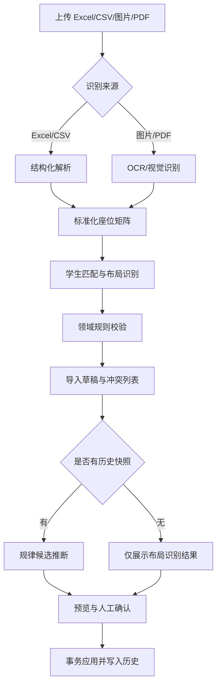

# 座位图导入与规律推断设计

状态：`v0.2 / 设计中`

## 1. 背景

当前座次模块已经具备座位坐标、过道、门窗、禁用座位、锁定座位、历史快照和轮换方案。下一阶段需要支持从 Excel、CSV、图片或 PDF 导入座位图，并在有多张历史座位图时识别重复出现的轮换规律。

本功能采用“识别与推荐由模型或算法完成，校验与落库由领域规则完成”的混合方案。任何导入结果都先形成可编辑草稿，经过班主任确认后才覆盖当前座次。

## 2. 目标与非目标

### 2.1 目标

- 从结构化文件中稳定识别座位矩阵、学生和座位坐标。
- 从图片或 PDF 中识别表格、文字、空座和过道，并允许人工修正。
- 根据多张历史座位图推荐可能的轮换规律，并给出匹配率和证据。
- 复用现有座位校验、环境配置、锁定座位和历史恢复能力。
- 保留原始导入、标准化结果、人工修改和最终应用记录，支持审计和撤销。

### 2.2 非目标

- 不让大模型直接生成未经校验的最终座位坐标。
- 不根据姓名猜测性别、成绩、视力或其他敏感属性。
- 不在没有足够历史样本时宣称发现了稳定的时间规律。
- 第一阶段不跨班级共享学生数据训练模型。

## 3. 核心概念

| 概念 | 含义 |
| --- | --- |
| 布局识别 | 从单张座位图识别行数、列数、过道、方向和座位单元格 |
| 学生匹配 | 将导入文本匹配到当前班级的 `studentId` |
| 静态规则 | 单张图中可观察的约束，例如空座、固定座、分组和过道 |
| 时间规律 | 多张历史座位图之间的变换，例如整体后移、左右镜像或大组循环 |
| 导入草稿 | 解析后尚未写入当前座次的可编辑结果 |
| 规律候选 | 一个变换及其参数、匹配率、冲突数和样本范围 |

## 4. 总体流程



## 5. 输入和识别策略

### 5.1 Excel/CSV

结构化文件优先采用确定性解析，不依赖机器学习。

- 支持当前系统导出的座位矩阵格式。
- 支持“学生名单 + 行号 + 座号”明细格式。
- 识别标题、`第 N 排`、`第 N 座`、空列和合并单元格。
- 识别过道时优先使用空列、列标题和单元格样式；无法确定时交给用户确认。
- 学生匹配优先使用学号，其次使用标准化姓名，再提供模糊候选。

### 5.2 图片/PDF

图片和 PDF 使用 OCR 或视觉模型提取候选网格，再由规则层重建矩阵。

- 先检测表格线和单元格边界，再识别单元格文字。
- 将识别结果保存为原始文本、坐标框和标准化单元格，便于回显和纠错。
- 必须允许用户确认行列方向、讲台方向、镜像关系和过道位置。
- OCR 结果不能直接覆盖当前座次；存在重复或无法匹配的学生时只能保存为草稿。

### 5.3 单张图可以推断的内容

- 行数和列数。
- 空座、过道和可能的禁用座位。
- 学生在当前图中的坐标。
- 文件中的前后方向、讲台或教室边界提示。

单张图不能可靠推断“下次如何轮换”。时间规律必须基于两张以上历史图，推荐使用三张或更多快照。

## 6. 规律推断

### 6.1 候选规则来源

第一阶段直接复用现有 `src/domain/seating-rotation.ts` 中的方案作为候选集合：

- 前后排前移或后移。
- 左右大组循环。
- 边列与中间列交换。
- 左右镜像、前后镜像和 180 度翻转。
- 自定义列映射。

后续可以增加静态排座规则，例如性别交错、成绩分层、避免特定学生相邻和前排优先。这些规则应使用学生已有的明确字段，不从姓名推测属性。

### 6.2 计算方法

对相邻历史快照建立学生位置变化：

```text
(旧 row, 旧 column) -> (新 row, 新 column)
```

对每个候选变换计算：

```text
匹配率 = 符合变换的学生数 / 可比较的学生数
```

同时扣除以下冲突：

- 变换后越界。
- 目标位置是禁用座位。
- 目标位置与锁定座位冲突。
- 同一学生或同一座位出现重复。
- 历史快照中学生已经转出，无法建立对应关系。

结果必须包含证据，而不是只返回一个标签：

```json
{
  "ruleType": "GROUP_CYCLE_RIGHT",
  "parameters": { "rowDirection": "BACKWARD", "rowStep": 1, "groupWidth": 2 },
  "confidence": 0.93,
  "matchedTransitions": 29,
  "comparableTransitions": 31,
  "conflicts": []
}
```

建议的展示策略：

- 匹配率达到配置阈值且没有硬冲突时标记为“推荐”。
- 有少量不一致时标记为“可能”，同时列出不一致的学生。
- 样本不足或没有稳定候选时显示“未发现稳定规律”。
- 置信度是推荐参考，不能绕过用户确认和领域校验。

### 6.3 规则与机器学习的边界

小规模班级座位图的候选规则数量有限，使用候选枚举和约束评分比训练黑盒深度模型更容易解释、测试和回滚。机器学习主要用于：

- 图片/PDF 的视觉识别。
- OCR 文本和学生的候选匹配排序。
- 样本增多后，对规则候选进行排序或估计教师偏好。

最终坐标仍然必须经过 `validateSeatingLayout` 和 `validateSeatingEnvironment` 等领域校验。

## 7. 用户流程

座次表新增“导入座位图”入口，采用四步流程：

1. **上传**：选择 Excel、CSV、图片或 PDF，显示文件名和来源类型。
2. **识别**：展示座位网格、行列、过道、方向和学生匹配结果。
3. **推断**：展示规律候选、匹配率、冲突和受影响学生；用户可编辑规则参数。
4. **确认**：以当前座次和导入结果的差异视图展示变更，确认后事务应用并写入历史。

以下情况只允许保存草稿，不允许直接应用：

- 班级外学生或无法匹配的学生未处理。
- 存在重复学生或重复座位。
- 行列、过道或方向无法确定。
- 存在越界、锁定座位冲突或禁用座位占用。

确认后可以将本次人工修正保存为班级级“导入模板”或“规律方案”，供后续导入使用。

## 8. 数据模型建议

### 8.1 `SeatingImportJob`

用于保存一次导入任务和可恢复的中间结果。

| 字段 | 说明 |
| --- | --- |
| `id` | 导入任务 ID |
| `classId` | 所属班级，服务端取得 |
| `operatorId` | 操作人 |
| `sourceType` | `XLSX`、`CSV`、`IMAGE`、`PDF` |
| `originalFileName` | 原始文件名 |
| `sourceHash` | 文件摘要，避免重复导入 |
| `status` | `PENDING`、`REVIEWING`、`APPLIED`、`REJECTED` |
| `extractedGrid` | 原始识别网格 JSON |
| `normalizedAssignments` | 标准化座位分配 JSON |
| `confidence` | 布局、文字、匹配等分项置信度 JSON |
| `issues` | 错误、警告和待确认项 JSON |
| `createdAt` / `appliedAt` | 生命周期时间 |

### 8.2 `SeatingRuleProfile`

用于保存班级级别的规律模板，不直接替代座位历史。

| 字段 | 说明 |
| --- | --- |
| `id` | 方案 ID |
| `classId` | 所属班级 |
| `name` | 用户可读名称 |
| `ruleType` | 规则类型 |
| `parameters` | 行列变换和约束参数 JSON |
| `confidence` | 最近推断置信度 |
| `sampleCount` | 参与推断的快照数量 |
| `source` | `MANUAL` 或 `INFERRED` |
| `active` | 是否用于推荐 |

应用后的结果继续写入现有 `SeatingHistory`，并使用 `triggerType` 区分 `IMPORT`、`INFERRED_RULE` 和 `MANUAL`。这样可以保留完整的撤销和恢复路径。

## 9. API 草案

建议将导入拆成预览和应用两个阶段：

```text
POST /api/seating/imports
```

上传文件并创建导入任务，返回解析状态和任务 ID。

```text
GET /api/seating/imports/:id
```

返回识别网格、标准化结果、匹配候选、冲突和置信度。

```text
POST /api/seating/imports/:id/infer
```

基于当前班级历史快照生成规律候选；请求可以带用户调整的行列方向和规则参数。

```text
POST /api/seating/imports/:id/apply
```

再次在服务端校验草稿，使用事务更新班级布局、座位分配和历史记录。服务端不信任客户端传入的 `classId`、学生归属或最终置信度。

## 10. 代码边界

建议按现有模块拆分：

- `src/domain/seating-import.ts`：标准化网格、匹配结果和导入校验。
- `src/domain/seating-rule-inference.ts`：候选规则、匹配率和冲突评分。
- `src/components/seating/SeatingImportModal.tsx`：上传、预览、纠错和确认。
- `src/app/api/seating/imports/route.ts`：创建任务和查询预览。
- `src/app/api/seating/imports/[id]/infer/route.ts`：规律推断。
- `src/app/api/seating/imports/[id]/apply/route.ts`：事务应用。
- `prisma/schema.prisma`：导入任务和规律方案模型。

现有能力可以直接复用：

- `src/domain/seating.ts` 的布局和环境校验。
- `src/domain/seating-rotation.ts` 的轮换变换。
- `src/domain/seating-history.ts` 的快照和差异处理。
- `src/lib/seating-export.ts` 的座位矩阵格式，作为首个 Excel 导入模板。

## 11. 安全和隐私

- 所有导入任务必须绑定当前鉴权上下文中的 `classId`。
- 只允许匹配当前班级的学生，禁止通过导入文件跨班级写入。
- 原始图片和 PDF 设置保存期限；应用完成后可以只保留摘要和结构化结果。
- 不把学生姓名、学号和导入原图发送给未经批准的外部模型服务。
- 日志中不记录原始文件内容、完整学生名单或个人敏感属性。
- 任何模型或 OCR 结果都视为不可信输入，先经过 Zod 和领域校验。

## 12. 验收标准

### 12.1 导入

- 支持系统导出的 Excel 座位矩阵再次导入，并保持行列、学生和过道一致。
- 重复学生、重复座位、越界位置和班级外学生均被拒绝或进入待确认列表。
- 图片/PDF 识别结果可以逐格编辑，未确认项不会自动覆盖当前座次。

### 12.2 规律推断

- 少于两张历史图时只提供布局识别，不显示确定的时间规律。
- 每个候选规律都显示参数、样本数量、匹配率和冲突列表。
- 规律应用后生成 `SeatingHistory`，可以恢复到应用前状态。
- 锁定座位、禁用座位和过道约束始终有效。

### 12.3 工程质量

- 导入解析、学生匹配、规则评分和冲突处理具备领域单元测试。
- API 覆盖未登录、跨班级、重复提交和事务失败场景。
- 原始文件无法解析时，任务状态可恢复为 `REJECTED`，不能产生部分座位写入。

## 13. 分阶段实施

### 阶段一：结构化导入

实现 Excel/CSV 导入、学号和姓名匹配、座位校验、预览和历史记录。此阶段不依赖模型。

### 阶段二：图片/PDF 识别

增加 OCR 或视觉识别，保留坐标框和置信度，提供逐格修正。

### 阶段三：历史规律推断

复用现有轮换方案，对多张 `SeatingHistory` 进行变换匹配，输出可解释的候选规律。

### 阶段四：约束优化

增加前排优先、避免相邻、分组平衡等可配置约束。机器学习只用于候选排序和偏好估计，最终排座仍由约束求解和领域校验完成。

## 14. 推荐决策

第一版先做“Excel/CSV 导入 + 预览确认 + 历史轮换规律匹配”。它可以最大程度复用现有座位模型和轮换代码，数据质量可控，能够验证用户是否真的需要图片识别和自动规律推荐。图片/PDF 识别和跨班级学习应在结构化导入稳定后再加入。
